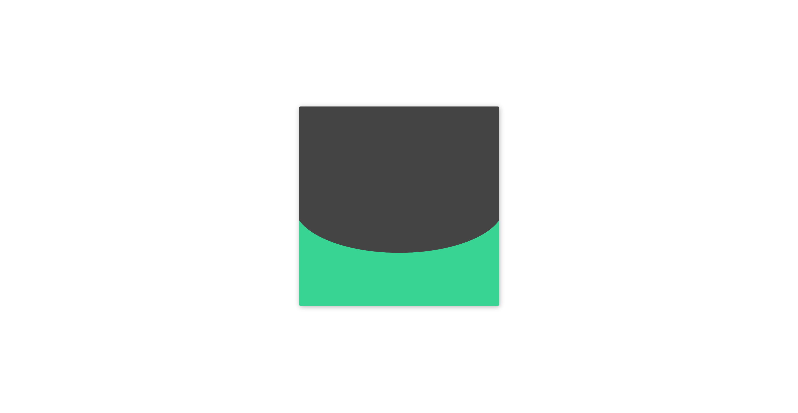

<h1>Day-18: Elastic</h1>

<h2>Challenge Description</h2>

Achieved a visually captivating elastic animation effect with simple CSS transformations and keyframes. The solution turned out to be easier than expected.

<h2>Table of Contents</h2>
<ul>
    <li><a href="#introduction">Introduction</a></li>
    <li><a href="#purpose">Purpose</a></li>
    <li><a href="#features">Features</a></li>
    <li><a href="#pre-requisites">Pre-requisites</a></li>
    <li><a href="#file-structure">File Structure</a></li>
    <li><a href="#tools">Tools</a></li>
    <li><a href="#preview">Preview</a></li>
    <li><a href="#contributing">Contributing</a></li>
    <li><a href="#credits">Credits</a></li>
    <li><a href="#author">Author</a></li>
</ul>

<h2 id="introduction">Introduction</h2>

This project demonstrates an elastic animation effect using CSS. The animation is designed to create a smooth, bouncing effect that is both visually appealing and simple to implement.

<h2 id="purpose">Purpose</h2>

The purpose of this project is to showcase a unique CSS animation technique that can be used to add dynamic visual effects to web elements. This effect can be useful for enhancing user interfaces and making web pages more engaging.

<h2 id="features">Features</h2>
<ul>
    <li>Simple and clean CSS code.</li>
    <li>Smooth elastic animation effect.</li>
    <li>Easy to integrate into any web project.</li>
    <li>Responsive design.</li>
</ul>

<h2 id="pre-requisites">Pre-requisites</h2>

Before you begin, ensure you have met the following requirements:

<ul>
    <li>You have a web browser.</li>
    <li>You have basic knowledge of HTML and CSS.</li>
</ul>

<h2 id="file-structure">File Structure</h2>

The project directory is structured as follows:

<pre>
Day-18-Elastic/
├── index.html
├── styles.css
├── README.md
</pre>

<h2 id="tools">Tools</h2>

The following tools were used in the development of this project:

<ul>
    <li>Visual Studio Code</li>
    <li>GitHub</li>
    <li>CodePen</li>
</ul>

<h2 id="preview">Preview</h2>

You can view a live demo of the project <a href="https://codepen.io/Yashi-the-lessful/pen/ZENZPGJ">here</a>.

ScreenShot

<h2 id="contributing">Contributing</h2>

Contributions are always welcome! Please follow these steps to contribute:

<ol>
    <li>Fork the repository on GitHub.</li>
    <li>Clone your fork locally:</li>
    <pre><code>git clone https://github.com/Yashi-Singh-1/Day-18-Elastic.git</code></pre>
    <li>Create a new branch:</li>
    <pre><code>git checkout -b feature/your-feature-name</code></pre>
    <li>Make your changes and commit them:</li>
    <pre><code>git commit -m "Add your commit message here"</code></pre>
    <li>Push your changes to your fork:</li>
    <pre><code>git push origin feature/your-feature-name</code></pre>
    <li>Open a pull request in the original repository and describe your changes.</li>
</ol>

Thank you for your contributions!

<h2 id="credits">Credits</h2>

This project was inspired by the <a href="https://100dayscss.com/days/18/">100 Days CSS Challenge</a>.

<h2 id="author">Author</h2>

Yashi Singh

